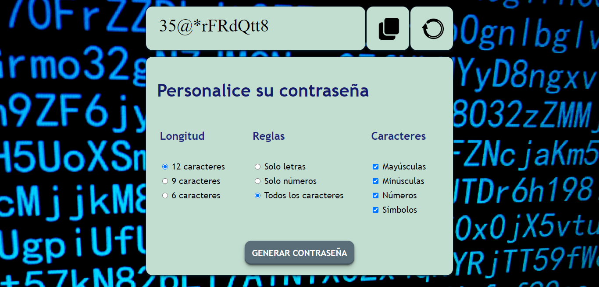

# Generador de contraseñas 

> *Proyecto del módulo 1 de JavaScript para Ada ITW*   
---
### [¡Hecha un vistazo!](https://vrocioquiroz.github.io/js-tp-generador-de-contrase-as/)

El proyecto consiste en crear un generador de contraseñas.    
El sitio  permitirá generar una contraseña con caracteres aleatorios basados en lo que el usuario tilde, eligiendo entre mayúsculas, minúsculas, números y símbolos.
Tendrá un botón de copiar contraseña y otro que dá la opción para generar una nueva si el usuario así lo desea.

### Tecnologías utilizadas para crear este sitio:
:small_orange_diamond:  HTML5

:small_orange_diamond:  CSS3    

:small_orange_diamond:  JavaScript  

Con ellas desarrollaremos la estructura, los estilos y su funcionalidad.

### Acerca de este proyecto   
- Sección de visualización de la contraseña, con botón de copiar y generar.   
- Sección de personalización, con opciones de longitud, reglas y caracteres disponibles.    
- Debe respetar la arquitectura propuesta.   
- JavaScript con utilización de arrow functions, variables let y const, arrays, bucles, condicionales y parámetros reutilizables.    
El código utiliza un único idioma (español).
- HTML con estructura semántica y buena nomenclatura de clases.
- CSS con estilos manuales, sin librerías ni frameworks.
- Diseño responsivo multiplataforma.
- Deployado y accesibilidad desde una URL.
- Repositorio en GitHub con readme, se trabaja en una rama (branch) de desarrollo, que al finalizarse el proyecto hará merge de la misma a main.    
---
### Diseño y funcionalidad

---